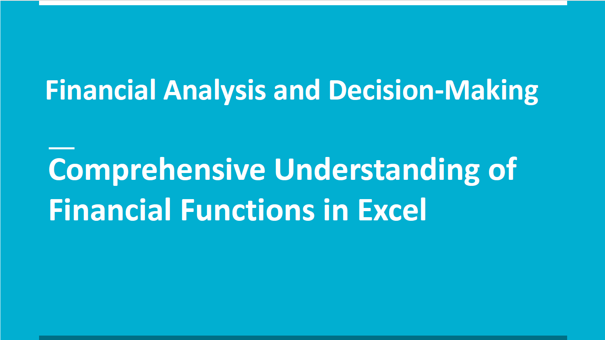
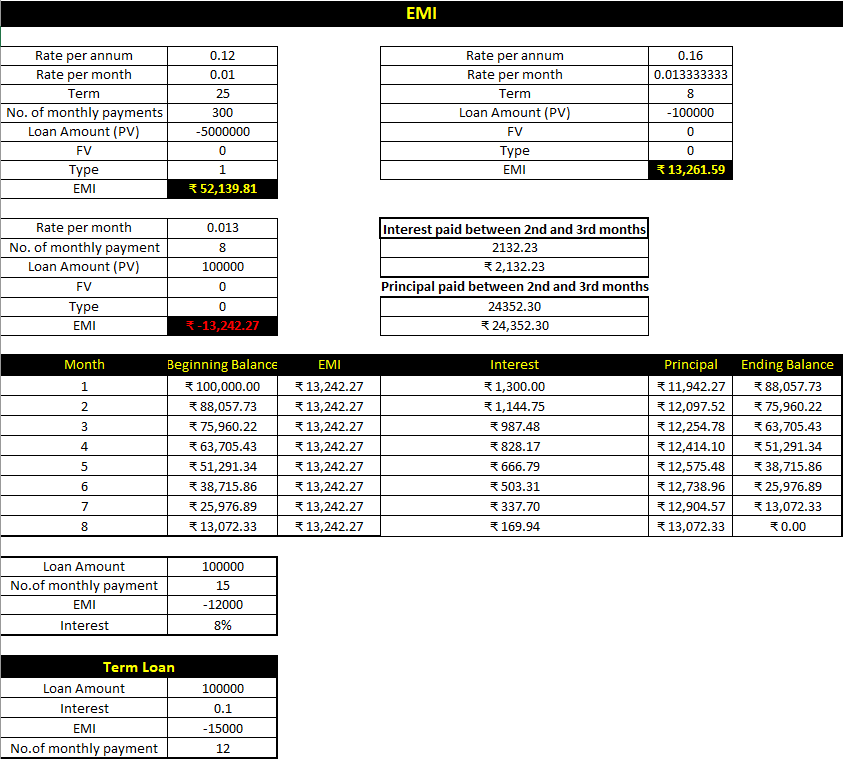
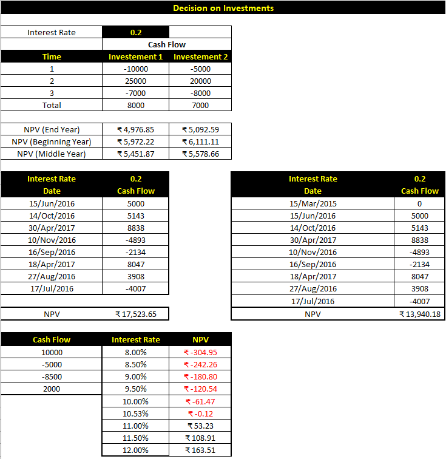
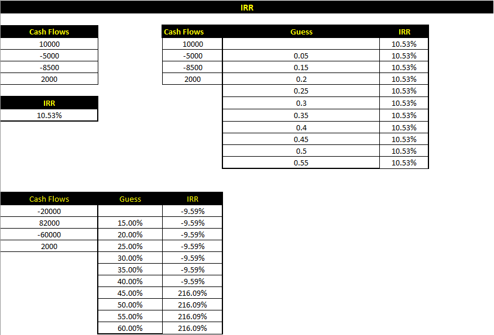
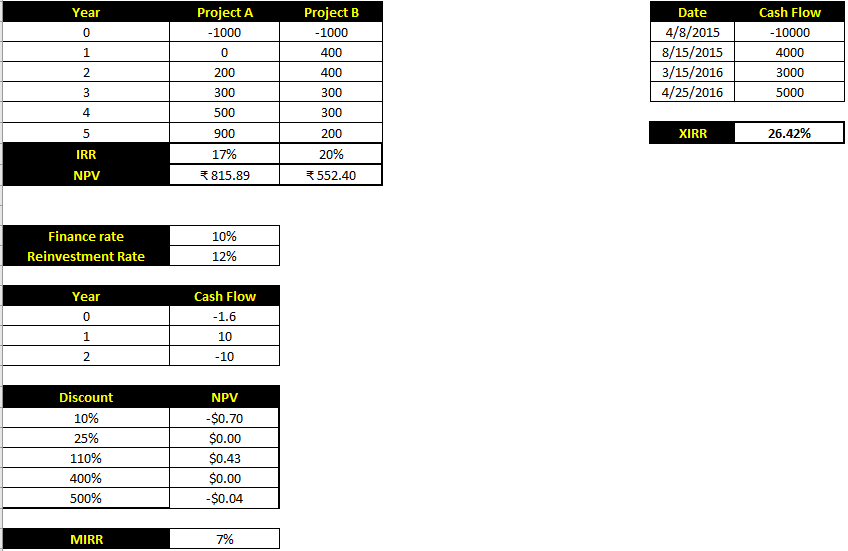

# Financial Analysis Decision Making Excel

## Overview
This project applies Excel-based financial analysis techniques to evaluate loans, annuities, amortization, and investment decisions. It demonstrates how financial functions can support structured decision-making in personal and business finance scenarios.

## Problem Statement
Financial decisions involving loans, annuities, project returns, and investment comparisons require accurate calculation and interpretation. Without structured modeling, decisions may be inefficient or misleading.

## Objectives
- Calculate EMIs and loan repayment structures
- Analyze annuities and present value concepts
- Compare projects using NPV and IRR
- Build financial decision support models in Excel

## Tools & Functions Used
- Microsoft Excel
- PV
- PMT
- NPV
- IRR
- XIRR
- MIRR
- Amortization Analysis

## Methodology
1. Structured financial scenarios in Excel
2. Applied core financial formulas
3. Built amortization and repayment views
4. Compared investment cases using NPV and IRR
5. Interpreted outputs into recommendations

## Key Insights
- EMI and amortization views improve repayment understanding
- NPV supports value-based project comparison
- IRR supports return-rate comparison across alternatives
- Different financial metrics can lead to different investment decisions

## Recommendations
- Use NPV when maximizing total project value is the priority
- Use IRR when comparing capital efficiency across options
- Combine multiple metrics rather than relying on a single indicator

## Repository Structure
- `docs/` – project documentation PDF
- `assets/` – screenshots of calculations or summary tables
- `source/` – Excel workbook

## Outcome
This project demonstrates financial analysis capability using Excel for decision support, investment comparison, and repayment modeling.

## Assets

## Author
Rampravesh Vishwakarma  
Business Analyst / Financial Analyst
